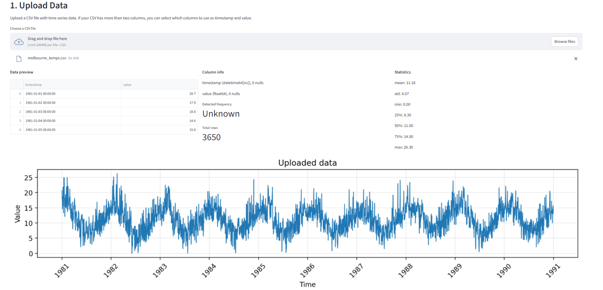
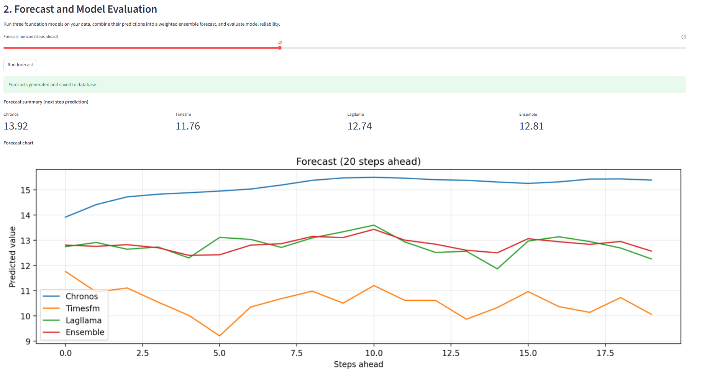
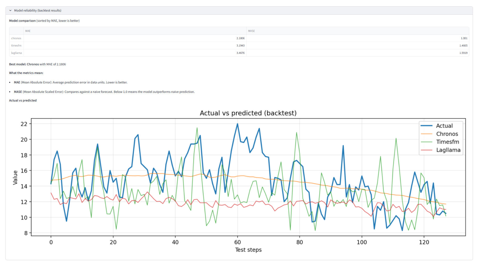
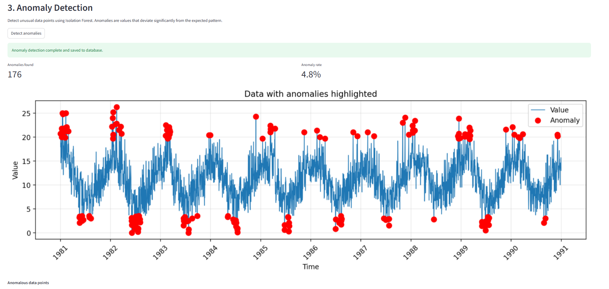
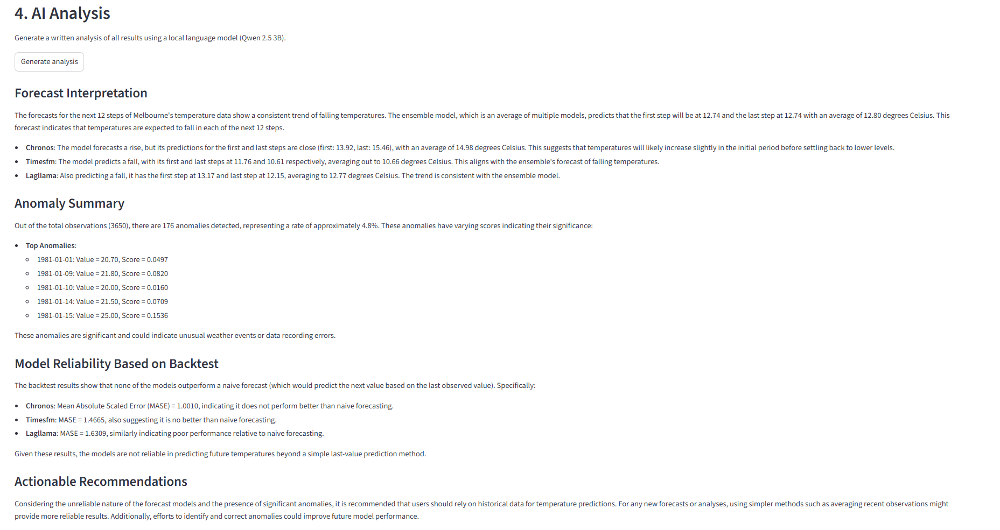
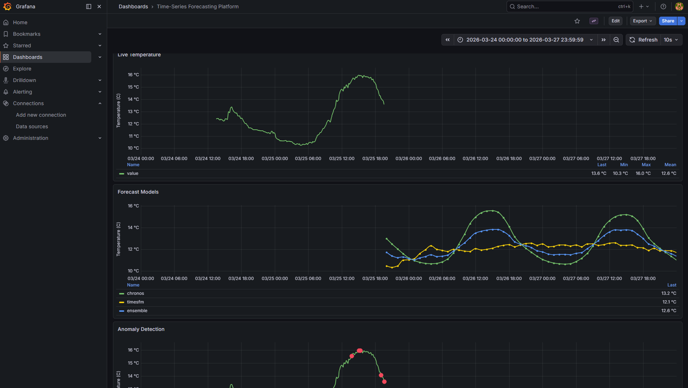
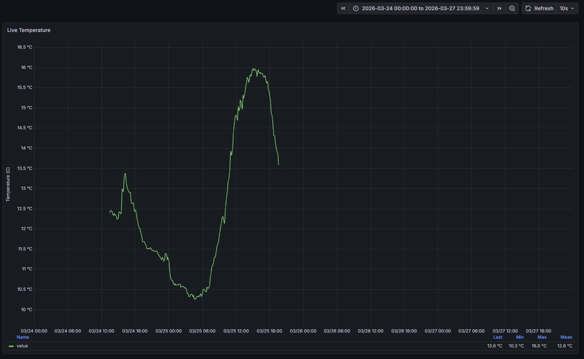
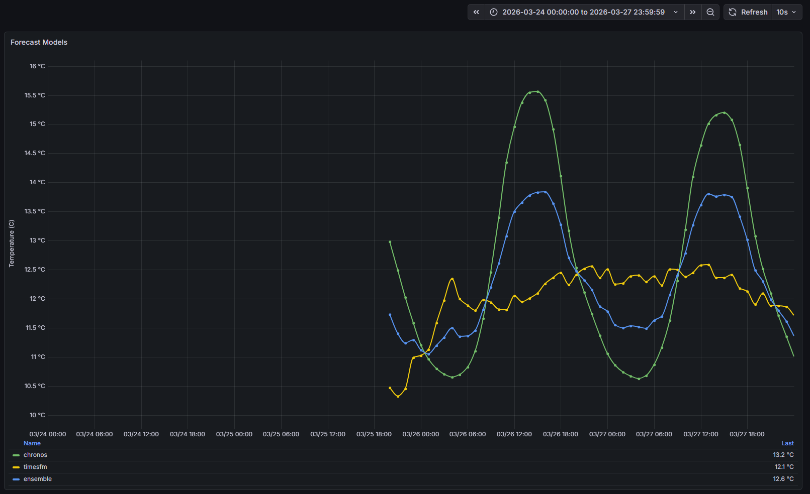
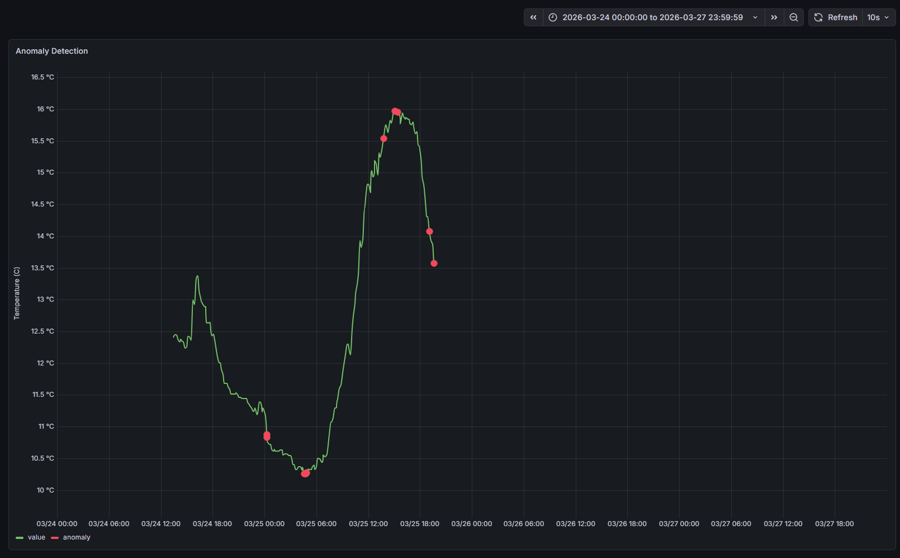
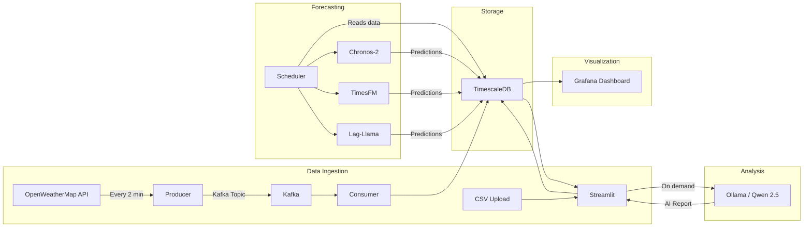

# Multi-Model Time-Series Forecasting Platform

A forecasting platform that accepts univariate time-series CSV data, runs three foundation models, produces ensemble predictions, detects anomalies, and generates AI analysis reports.


<details>
<summary>Streamlit Screenshots</summary>







</details>

<details>
<summary>Grafana Screenshots</summary>






</details>

## What the platform does


1. Validates and preprocesses the data (gap filling, resampling, deduplication).
2. Runs three forecasting models and combines them into an ensemble prediction.
3. Detects anomalies using Isolation Forest.
4. Evaluates model reliability via backtesting (MAE, MASE metrics).
5. Generates a written analysis using a local language model (Qwen 2.5 3B via Ollama).
6. Exports a full PDF report with charts, metrics, and AI analysis.

## Forecasting Models

| Model | Type | Parameters | Description |
|-------|------|------------|-------------|
| Chronos-2 Bolt | Encoder-decoder transformer | ~70M | Amazon's pre-trained time-series model. Best overall accuracy in testing. |
| TimesFM 2.0 | Patched decoder transformer | 500M | Google's foundation model for time-series. Configured with a 128-step horizon. |
| Lag-Llama | Lag-based transformer | 2.4M | Lightweight probabilistic model using lagged features. Fast inference. |
| Ensemble | Equal-weight average | - | Combines all three models to reduce individual prediction errors. |

All models run zero-shot, meaning they produce forecasts on any dataset without training or fine-tuning.

## Tech Stack

| Component | Technology |
|-----------|------------|
| Web UI | Streamlit |
| Database | PostgreSQL + TimescaleDB |
| Streaming | Apache Kafka |
| Monitoring | Grafana |
| Anomaly detection | PyOD (Isolation Forest) |
| AI analysis | Qwen 2.5 3B via Ollama |
| PDF reports | fpdf2 + Matplotlib |
| CI/CD | GitHub Actions |
| Containerization | Docker Compose (8 containers) |

## Quick Start

Prerequisites: Docker, NVIDIA GPU with drivers, Ollama installed with `qwen2.5:3b` model.

```bash
git clone https://github.com/KonstantinosPls/Time-Series-Forecasting-Platform.git
cd Time-Series-Forecasting-Platform
cp .env.example .env
docker-compose up --build
```

Access the platform:
- Streamlit UI: http://localhost:8501
- Grafana dashboard: http://localhost:3000 (admin/admin)

## How It Works

The workflow is splitted into five sections:

**1. Upload Data** -- Upload a univariate time-series CSV. The platform auto-detects timestamp and value columns, shows data statistics, column types, and frequency detection. Supports multi-column CSVs with manual column selection.

**2. Forecast and Model Evaluation** -- Runs all three models on your data, computes an ensemble prediction, and automatically backtests each model using an 80/20 train/test split. Shows forecast charts, per-model metrics, and identifies the best-performing model.

**3. Anomaly Detection** -- Identifies unusual data points using Isolation Forest. Displays anomaly count, rate, and a chart with highlighted anomalous points.

**4. AI Analysis** -- Sends all computed results to a local Qwen 2.5 3B model via Ollama. The model generates a structured written analysis covering data characteristics, forecast interpretation, anomaly findings, model reliability, and actionable recommendations. The analysis is grounded in the computed results to minimize hallucinations.

**5. Download Report** -- Generates a comprehensive PDF report containing data summary, forecast results with charts, full anomaly table, backtest metrics with comparison chart, and the AI-generated analysis.

## Architecture



## Real-Time Streaming

The platform supports live data ingestion through Apache Kafka. A producer service fetches data from an external API at regular intervals, pushes it to a Kafka topic, and a consumer service saves it to TimescaleDB. A scheduler service runs every hour, reads the accumulated data, runs all forecast models, and writes predictions back to the database. In a production environment, the scheduler could be replaced with Prefect for more robust workflow orchestration, retry logic, and monitoring.

For this project, I used an OpenWeatherMap API key to stream live temperature data for Athens, Greece. The Grafana screenshots below show this data. The streaming pipeline can be adapted to any data source (crypto prices, energy demand, sensor readings) by modifying the producer script.

Lag-Llama is excluded from the automated pipeline until enough data accumulates (at least twice the forecast horizon). This is because Lag-Llama relies on lag features that need sufficient historical data to produce meaningful results. Chronos and TimesFM handle smaller datasets well and run from the start. Once the threshold is crossed, Lag-Llama joins the ensemble automatically.

## Grafana

The Grafana dashboard is provisioned automatically on startup with three panels:
- Live data from the streaming pipeline
- Forecast predictions from each model and the ensemble
- Anomaly detection with flagged data points

The dashboard auto-refreshes every 10 seconds.

## Limitations

**Forecast horizon:** TimesFM is configured with a horizon window of 128 steps. This value can be increased, though accuracy may decrease with longer horizons. Chronos has no hard limit but accuracy degrades after approximately 64 steps as prediction errors compound with each successive step. The forecast slider is capped at 48 steps for practical use.

**Model context:** Lag-Llama only considers the last 512 data points when making predictions. For datasets larger than 512 rows, earlier data is ignored. This value can be increased on machines with stronger GPU cards.

**Data format:** Only univariate time-series data is supported (one timestamp column and one value column). Multivariate forecasting (multiple value columns) could be implemented with the use of different models.

**Zero-shot accuracy:** All models run without fine-tuning on your specific data. Performance varies by dataset. Models work best on data with clear repeating patterns and struggle with highly volatile data (daily temperatures).

**Infrastructure:** Requires an NVIDIA GPU with CUDA support. The first forecast run is slow due to model weight downloads (~2.5 GB total). Ollama must be running separately from Docker.

**AI analysis:** The Qwen 2.5 3B model is constrained to 1200 output tokens per analysis. On rare occasions it may produce slightly generic recommendations, though all numerical references are strictly grounded in the computed results.

## Requirements

- Docker and Docker Compose
- NVIDIA GPU with CUDA support
- Ollama with `qwen2.5:3b` model installed
- ~13 GB disk space for Docker images and model weights
